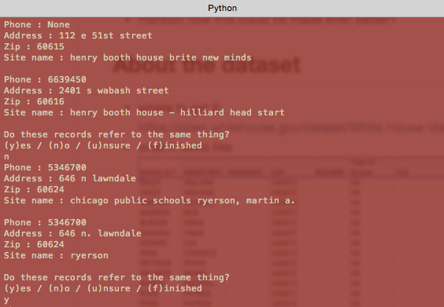

# Basics of Entity Resolution with Python and Dedupe
_by Kyle Rossetti and Rebecca Bilbro_

####All annotations start with -- double dash
#### -- Ensure that certain examples have a business case associated with it; helps to frame the example
#### -- The placement of examples and visualization should be more frequent
####    -- How to visualize blocking and predicates


## Introduction    
### What is entity resolution?    
Entity resolution (ER) is the task of disambiguating records that correspond to real world entities across and within datasets. The applications of entity resolution are tremendous, particularly for public sector and federal datasets related to health, transportation, finance, law enforcement, and antiterrorism.  

Unfortunately, the problems associated with entity resolution are equally tremendous — as the volume and velocity of data grow, inference across networks and semantic relationships between entities becomes more and more difficult. Data quality issues, schema variations, and idiosyncratic data collection traditions can all complicate these problems even further. When combined, such challenges amount to a substantial barrier to organizations’ ability to fully understand their data, let alone make effective use of predictive analytics to optimize targeting, thresholding, and resource management.  

The three primary tasks involved in entity resolution are deduplication, record linkage, and canonicalization:    
1. Deduplication    
2. Record linkage    
3. Canonicalization    

This post will explore some basic approaches to entity resolution using the Python `dedupe` library. Let us first examine what is an entity? Taking a step back from the data realm, an entity is a distinct object with qualifying attributes to describe it as unique. So why is entity resolution a common issue in large data sets, and how does it relate to data science? ER is the process of ensuring no duplicates within a dataset exists to affect the analysis of the data.

Common issues with resolving entity redundancy?
There are many ways we encounter redundancy in a dataset.

So what? Why is entity resolution important to us?     
Entity resolution is not a new problem nor concept for those working with data sets.


## About Dedupe
[Dedupe](https://pypi.python.org/pypi/dedupe/1.4.3) is a library that uses machine learning to perform deduplication and entity resolution quickly on structured data. It isn't the only tool available in Python for doing entity resolution tasks, but it is the only one (as far as we know) that conceives of entity resolution as it's primary task. In addition to removing duplicate entries from within a single dataset, Dedupe can also do record linkage across disparate datasets.

__discuss scaling__    

### How Dedupe works    
Effective deduplication relies largely on domain expertise. This is for two main reasons: firstly because domain experts through their experiences develop a set of heuristics that enable them to conceptualize what a canonical version of a record _should_ look like, even if they've never seen it in practice. Secondly, domain experts instinctively recognize which record subfields are most likely to uniquely identify a record; they just know where to look. As such, Dedupe works by engaging the user in labeling the data via a command line interface, and using machine learning on the resulting training data to predict similar or matching records within unseen data.    

### Blocking, affine gap distance, and active learning    
Let's imagine that our dataset is a list of people represented by attributes like names, addresses, personal characteristics and preferences.

__this is a placeholder image - we should make a better one to illustrate these concepts__    


Our goal, then, is to deduplicate the list to ensure that only one record exists for each person. Features like names, phone numbers, and zipcodes are probably going to be more useful than state, age, or favorite food. When comparing records, rather than treating each record as a single long string, Dedupe cleverly exploits the structure of the input data to instead compare the records _field by field_. The advantage of this approach is more pronounced when certain feature vectors of records are much more likely to assist in identifying matches than are other attributes. Dedupe lets the user nominate the features they believe will be most useful:   

```python
fields = [
    {'field' : 'Firstname', 'type': 'String'},
    {'field' : 'Lastname', 'type': 'String'},
    {'field' : 'Zip', 'type': 'Exact', 'has missing' : True},
    {'field' : 'Phone', 'type': 'String', 'has missing' : True},
    ]
```    

Dedupe scans the data to create tuples of records that it will propose to the user to label as being either matches, not matches, or possible matches. These `uncertainPairs` are identified using a combination of __blocking__ , __affine gap distance__ and __active learning__.

Blocking is used to reduce the number of overall record comparisons that need to be made. Dedupe's method of blocking involves engineering subsets of feature vectors (these are called 'predicates') that can be compared across records. In the case of our people dataset above, the predicates might be things like:     
  - the first three digits of the phone number    
  - the full name    
  - the first five characters of the name    
  - a random 4-gram within the city name     

Records are then grouped ('blocked') by matching predicates, so that only records with matching predicates will be compared to each other during the active learning phase. The blocks are developed by computing the edit distance between predicates across records. Dedupe uses a distance metric called affine gap distance, which is a variation on Hamming distance that makes subsequent consecutive deletions or insertions cheaper.

__diagram to explain affine gap distance__    

The relative weight of these different feature vectors can be learned during the active learning process and expressed numerically to ensure that features that will be most predictive of matches will be 'heavier' in the overall matching schema. As the user labels more and more tuples, Dedupe gradually relearns the weights, recalculates the edit distances between records, and updates its list of the most uncertain pairs to propose to the user for labeling.

Once the user has generated enough labels, the learned weights are used to calculate the probability that each pair of records within a block is a duplicate or not.  In order to scale the pairwise matching up to larger tuples of matched records (in the case that entities may appear more than twice within a document), Dedupe uses hierarchical clustering with centroidal linkage. Records within some threshold distance of a centroid will be grouped together. The final result is an annotated version of the original dataset that now includes a centroid label for each record.    

## Testing out `dedupe`
_Start by walking people through the csv_example.py from the `dedupe-examples` repo_

Let's experiment with using the `dedupe` library to try cleaning up our file. To get `dedupe` running, we'll need to install Unidecode, Future, and Dedupe.    

In your terminal (we recommend doing so inside a [virtual environment](https://districtdatalabs.silvrback.com/how-to-develop-quality-python-code)):    

```bash
git clone https://github.com/DistrictDataLabs/dedupe-examples.git
cd dedupe-examples

pip install unidecode
pip install future
pip install dedupe
```

Then we'll run the csv_example.py file to see what dedupe can do:    

```bash
python csv_example.py
```

You can see that `dedupe` is a command line application that will prompt the user to engage in active learning by showing pairs of entities and asking if they are the same or different.


```bash
Do these records refer to the same thing?
(y)es / (n)o / (u)nsure / (f)inished
```

You can experiment with typing the 'y', 'n' and 'u' keys to flag duplicates for active learning. When you are finished, enter 'f' to quit.

## Active learning

When conducting the supervised learning portion of the deduplicaton of your data set, it is importation to see what type of attributes are selected as well as the choices you assess during the session. you are presented with 4 options;

In Figure 1, you see the first set of pairwise with the four choices below:

(y)es, being a affirmation of the duplicate,
(n)o, being a negative of the duplicate,
(u)nsure, meaning you cannot make a decision due to a lack of information,
or (f)inished, thus completing the session.

#####Figure 1.


#####Figure 2.


As you can see in the example above, the first tuple that contains zero for zero hits on all four attributes being examined, the verdict is most certainly a non-match, with a no being returned to the machine for duplication. On the second tuple, we have a 3/4 exact match, with the fourth being fuzzy in that one entity contains a piece of the matched entity; Ryerson vs Chicago Public Schools Ryerson. A human would be able to to discern these matches as two canonicalized entities, but a machine needs to such a fuzzy match affirmed.

#####Figure 3.


In the last tuple example, the authors would like to present the reader with an example for them to assess as to what it should be categorized as. Should this tuple be marked as a duplicate? Or is this a definite no, or is the reader completely unsure, and would require additional information to make their decision?

- discuss what is going on under the hood    
- mention how this could be made even better?   

## About the dataset
- where to get it:     
https://open.whitehouse.gov/dataset/White-House-Visitor-Records-Requests/p86s-ychb    
- what it looks like    

###How to load it into Python    
  As a .csv file
- what the features are    
- how to get the data into shape for analysis  

5. About the dataset (Kyle)

The data set was pulled from the WhiteHouse.gov website, apart of the executive initiative for making more federal data open to the public. This particular set of data is a list of White House visitor record requests from 2006-2010. The schemas within the data set include:

 - NAMELAST  (Last name of entity)    
 - NAMEFIRST (First name of entity)    
 - NAMEMID (Middle name of entity)    
 - UIN (Unique Identification Number)    
 - BDGNBR (Badge Number)    
 - Type of Access (Access type to White House)
 - TOA  (Time of Arrival)  
 - POA    
 - TOD
 - POD
 - APPT_MADE_DATE (When the appointment date was made)
 - APPT_START_DATE (When the appointment date is scheduled to start)
 - APPT_END_DATE (When the appointment date is scheduled to end)
 - APPT_CANCEL_DATE (When the appointment date was canceled)
 - Total_People (Total number of people scheduled to attend)
 - LAST_UPDATEDBY (Who was the last person to update this event)
 - POST	(?)
 - LastEntryDate (When the last update to this instance)
 - TERMINAL_SUFFIX (where was 0)
 - visitee_namelast (The visitee's last name)
 - visitee_namefirst (The visitee's first name)
 - MEETING_LOC (The location of the meeting)
 - MEETING_ROOM	(The room number of the meeting)
 - CALLER_NAME_LAST (?)
 - CALLER_NAME_FIRST	(?)
 - CALLER_ROOM (?)
 - Description (Description of the event or visit)
 - RELEASE_DATE (The date this set of logs were released to the public)

The data source itself can be exported in a variety of formats to include, .json, .csv, and .xlsx, .pdf, .xlm, and RSS.   With 5 million data sets it can be a bit daunting for different formats.


## Tailoring the code
Next we'll discuss what is needed to tailor a `dedupe` example to get the code to work for the White House visitors log dataset. The main challenge with this dataset is it's sheer size. Fortunately the dedupe-examples repo includes several examples that use databases. We'll be adapting the [PostgreSQL example](https://github.com/datamade/dedupe-examples/blob/master/pgsql_example/pgsql_example.py)

First we'll need to import a few modules:    

```python
import csv
import psycopg2
from dateutil import parser
```

Next, we'll need to connect to our database:    

```python
conn = None

DATABASE = your_db_name
USER = your_user_name
HOST = your_hostname
PASSWORD = your_password

try:
    conn = psycopg2.connect(database=DATABASE, user=USER, host=HOST, password=PASSWORD)
    print "I've connected"
except:
    print "I am unable to connect to the database"
cur = conn.cursor()
```

The other challenge with our dataset are the numerous missing values and datetime formatting irregularities. In order to use the datetime strings to help with entity resolution, we'd like the formatting to be as consistent as possible. The following script handles both the datetime parsing and the missing values by combining Python's `dateutil` module and PostgreSQL's fairly forgiving 'varchar' type.
This function takes the csv data in as input, parses the datetime fields we're interested in, and outputs a database table that retains the desired columns (keep in mind this will take a while to run).    

```python
def dateParseSQL(nfile):
    cur.execute('''CREATE TABLE IF NOT EXISTS visitors_new
                  (lastname   varchar,
                  firstname   varchar,
                  uin         varchar,
                  apptmade    varchar,
                  apptstart   varchar,
                  apptend     varchar,
                  meeting_loc varchar);''')
    conn.commit()
    with open(nfile, 'rU') as infile:
        reader = csv.reader(infile, delimiter=',')
        next(reader, None)
        for row in reader:
            for field in DATEFIELDS:
                if row[field] != '':
                    try:
                        dt = parser.parse(row[field])
                        row[field] = dt.isoformat()
                    except:
                        continue
            sql = "INSERT INTO visitors_new(lastname,firstname,uin,apptmade,apptstart,apptend,meeting_loc) \
                   VALUES (%s,%s,%s,%s,%s,%s,%s)"
            cur.execute(sql, (row[0],row[1],row[3],row[10],row[11],row[12],row[21],))
            conn.commit()
```


## Results
- what do the results look like after active learning & how to interpret them    
- how many duplicates were identified? (give examples)    
- any errors? (and how could we make changes to prevent those kinds of errors?)    

## Conclusion

## Recommended Reading
- [A Primer on Entity Resolution by Benjamin Bengfort](http://www.slideshare.net/BenjaminBengfort/a-primer-on-entity-resolution)  
- [Entity Resolution for Big Data: A Summary of the KDD 2013 Tutorial Taught by Dr. Lise Getoor and Dr. Ashwin Machanavajjhala](http://www.datacommunitydc.org/blog/2013/08/entity-resolution-for-big-data)    
- [A Theory for Record Linkage by Ivan P. Fellegi and Alan B. Sunter](http://courses.cs.washington.edu/courses/cse590q/04au/papers/Felligi69.pdf)   
- etc.
